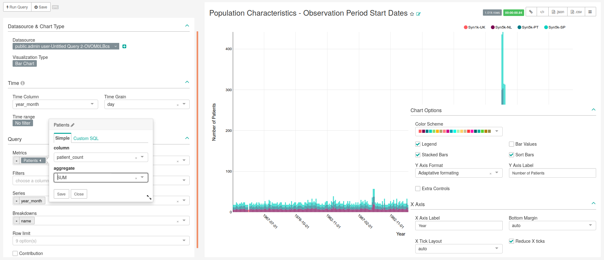
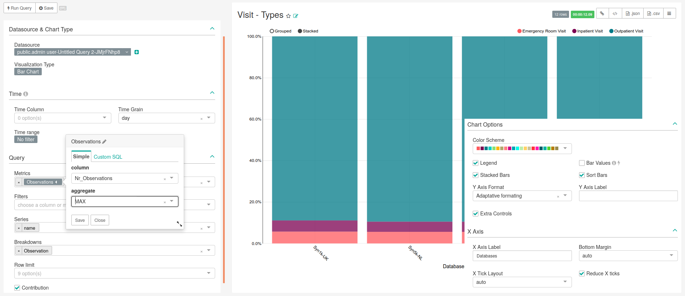

# Concepts

Discuss the organization of this dashboard
One tab uses the same query

## Concepts General Tab

Say the goal of this tab TO DO
Say that all the charts on this tab have the same query

### SQL query
           
```sql
SELECT
    q1.concept_id AS concept_id,
    q1.concept_name AS concept_name,
    q1.domain_id,
    source.name,
    sum(q1.count_value) AS "Occurrence_count",
    sum(q1.count_person) AS "Person_count",
    CASE 
        WHEN sum(q1.count_value)<=10 THEN '<=10'
        WHEN sum(q1.count_value)<=100 THEN '11-10ˆ2'
        WHEN sum(q1.count_value)<=1000 THEN '10ˆ2-10ˆ3'
        WHEN sum(q1.count_value)<=10000 THEN '10ˆ3-10ˆ4'
        WHEN sum(q1.count_value)<=100000 THEN '10ˆ4-10ˆ5'
        WHEN sum(q1.count_value)<=1000000 THEN '10ˆ5-10ˆ6'
        ELSE '>10ˆ6'
    END AS "magnitude_occurrences",
    CASE 
        WHEN sum(q1.count_person)<=10 THEN '<=10'
        WHEN sum(q1.count_person)<=100 THEN '11-10ˆ2'
        WHEN sum(q1.count_person)<=1000 THEN '10ˆ2-10ˆ3'
        WHEN sum(q1.count_person)<=10000 THEN '10ˆ3-10ˆ4'
        WHEN sum(q1.count_person)<=100000 THEN '10ˆ4-10ˆ5'
        WHEN sum(q1.count_person)<=1000000 THEN '10ˆ5-10ˆ6'
        ELSE '>10ˆ6'
    END AS "magnitude_persons"
FROM (SELECT analysis_id,
             stratum_1 concept_id,
             data_source_id,
             concept_name,
             domain_id,
             count_value, 0 AS count_person
    FROM achilles_results
    JOIN concept ON cast(stratum_1 AS BIGINT)=concept_id
    WHERE analysis_id in (201, 301, 401, 601, 701, 801, 901, 1001, 
        1801)
    UNION (SELECT  analysis_id,
                   stratum_1 concept_id,
                   data_source_id,
                   concept_name,
                   domain_id,
                   0 AS count_value,
                   sum(count_value) AS count_person
            FROM  achilles_results
            JOIN concept on cast(stratum_1 AS BIGINT)=concept_id
            WHERE analysis_id in (202, 401, 601, 701, 801, 901, 
                1001, 1801)
            GROUP BY analysis_id, stratum_1, data_source_id, 
                concept_name, domain_id) ) AS q1
    INNER JOIN public.data_source AS source ON q1.data_source_id=source.id
GROUP BY q1.concept_id, q1.concept_name, q1.domain_id,source.name;
```


### Charts

Here are all the charts presented in this dashboard using the previous query TO DO

#### Concept Browser Table

Discuss what is important to see in this chart... TO DO
The main characteristics of this chart are presented in Figure \@ref(fig:visitTypes), being the following:

- **Data Tab**:
    - **Visualization Type**: Bar Chart
    - **Time range**: No filter
    - **Metrics**:
    - **Filters**: Empty
    - **Series**:
    - **Breakdowns**:
    - **Row limit**: Empty
    - **Contribution**: Not checked
- **Costumize Tab**:
    - **Y Axis Label**: 
    - **X Axis Label**: 
    - **Legend**: Checked
    - **Stacked Bars**:
    - **Bar Values**:
    - **Sort Bars**:
    - **Extra Controls**:
    - **Reduce X ticks**:

<div class="figure">

<p class="caption">(\#fig:visitTypes3)Settings for creating chart representing the number of patients at the start of their observation period (bar chart). Image changed to contain information hidden in the customize menu.</p>
</div>

#### \# of Occurrences

Discuss what is important to see in this chart... TO DO
The main characteristics of this chart are presented in Figure \@ref(fig:visitTypes), being the following:

- **Data Tab**:
    - **Visualization Type**: Bar Chart
    - **Time range**: No filter
    - **Metrics**:
    - **Filters**: Empty
    - **Series**:
    - **Breakdowns**:
    - **Row limit**: Empty
    - **Contribution**: Not checked
- **Costumize Tab**:
    - **Y Axis Label**: 
    - **X Axis Label**: 
    - **Legend**: Checked
    - **Stacked Bars**:
    - **Bar Values**:
    - **Sort Bars**:
    - **Extra Controls**:
    - **Reduce X ticks**:

<div class="figure">

<p class="caption">(\#fig:visitTypes4)Settings for creating chart representing the number of patients at the start of their observation period (bar chart). Image changed to contain information hidden in the customize menu.</p>
</div>

#### \# of Patients

Discuss what is important to see in this chart... TO DO
The main characteristics of this chart are presented in Figure \@ref(fig:visitTypes), being the following:

- **Data Tab**:
    - **Visualization Type**: Bar Chart
    - **Time range**: No filter
    - **Metrics**:
    - **Filters**: Empty
    - **Series**:
    - **Breakdowns**:
    - **Row limit**: Empty
    - **Contribution**: Not checked
- **Costumize Tab**:
    - **Y Axis Label**: 
    - **X Axis Label**: 
    - **Legend**: Checked
    - **Stacked Bars**:
    - **Bar Values**:
    - **Sort Bars**:
    - **Extra Controls**:
    - **Reduce X ticks**:

<div class="figure">

<p class="caption">(\#fig:visitTypes5)Settings for creating chart representing the number of patients at the start of their observation period (bar chart). Image changed to contain information hidden in the customize menu.</p>
</div>

#### Entity Type Filter

Discuss what is important to see in this chart... TO DO
The main characteristics of this chart are presented in Figure \@ref(fig:visitTypes), being the following:

- **Data Tab**:
    - **Visualization Type**: Bar Chart
    - **Time range**: No filter
    - **Metrics**:
    - **Filters**: Empty
    - **Series**:
    - **Breakdowns**:
    - **Row limit**: Empty
    - **Contribution**: Not checked
- **Costumize Tab**:
    - **Y Axis Label**: 
    - **X Axis Label**: 
    - **Legend**: Checked
    - **Stacked Bars**:
    - **Bar Values**:
    - **Sort Bars**:
    - **Extra Controls**:
    - **Reduce X ticks**:

<div class="figure">

<p class="caption">(\#fig:visitTypes6)Settings for creating chart representing the number of patients at the start of their observation period (bar chart). Image changed to contain information hidden in the customize menu.</p>
</div>

#### Concept Filter

Discuss what is important to see in this chart... TO DO
The main characteristics of this chart are presented in Figure \@ref(fig:visitTypes), being the following:

- **Data Tab**:
    - **Visualization Type**: Bar Chart
    - **Time range**: No filter
    - **Metrics**:
    - **Filters**: Empty
    - **Series**:
    - **Breakdowns**:
    - **Row limit**: Empty
    - **Contribution**: Not checked
- **Costumize Tab**:
    - **Y Axis Label**: 
    - **X Axis Label**: 
    - **Legend**: Checked
    - **Stacked Bars**:
    - **Bar Values**:
    - **Sort Bars**:
    - **Extra Controls**:
    - **Reduce X ticks**:

<div class="figure">

<p class="caption">(\#fig:visitTypes7)Settings for creating chart representing the number of patients at the start of their observation period (bar chart). Image changed to contain information hidden in the customize menu.</p>
</div>

#### Number of Concepts

Discuss what is important to see in this chart... TO DO
The main characteristics of this chart are presented in Figure \@ref(fig:visitTypes), being the following:

- **Data Tab**:
    - **Visualization Type**: Bar Chart
    - **Time range**: No filter
    - **Metrics**:
    - **Filters**: Empty
    - **Series**:
    - **Breakdowns**:
    - **Row limit**: Empty
    - **Contribution**: Not checked
- **Costumize Tab**:
    - **Y Axis Label**: 
    - **X Axis Label**: 
    - **Legend**: Checked
    - **Stacked Bars**:
    - **Bar Values**:
    - **Sort Bars**:
    - **Extra Controls**:
    - **Reduce X ticks**:

<div class="figure">

<p class="caption">(\#fig:visitTypes8)Settings for creating chart representing the number of patients at the start of their observation period (bar chart). Image changed to contain information hidden in the customize menu.</p>
</div>


## Concepts Domains Tab

Discuss what is important to see in this chart... TO DO
Say that we use create 6 similar charts with different filters

### SQL query

```sql
-- Concepts Domains
SELECT source.name,
    CASE WHEN analysis_id = 405 THEN 'Condition'
    WHEN analysis_id = 605 THEN 'Procedure'
    WHEN analysis_id = 705 THEN 'Drug'
    WHEN analysis_id = 805 THEN 'Observation'
    WHEN analysis_id = 1805 THEN 'Measurement'
    WHEN analysis_id = 2105 THEN 'Device'
    ELSE 'Other' END AS domain_name,
    concept_name, sum(count_value) AS num_records
FROM public.achilles_results AS achilles 
    INNER JOIN public.data_source AS source ON 
      achilles.data_source_id=source.id
    INNER JOIN public.concept AS c1 ON 
      stratum_2 = CAST(concept_id AS text)
WHERE analysis_id IN (405, 605, 705, 805, 1805, 2105)
GROUP BY source.name, concept_name, 
    CASE WHEN analysis_id = 405 THEN 'Condition'
    WHEN analysis_id = 605 THEN 'Procedure'
    WHEN analysis_id = 705 THEN 'Drug'
    WHEN analysis_id = 805 THEN 'Observation'
    WHEN analysis_id = 1805 THEN 'Measurement'
    WHEN analysis_id = 2105 THEN 'Device'
    ELSE 'Other' END
```


### Chart settings

FILTER LIST

The main characteristics of this chart are presented in Figure \@ref(fig:visitTypes), being the following:

- **Data Tab**:
    - **Visualization Type**: Bar Chart
    - **Time range**: No filter
    - **Metrics**:
    - **Filters**: See filter list
    - **Series**:
    - **Breakdowns**:
    - **Row limit**: Empty
    - **Contribution**: Not checked
- **Costumize Tab**:
    - **Y Axis Label**: 
    - **X Axis Label**: 
    - **Legend**: Checked
    - **Stacked Bars**:
    - **Bar Values**:
    - **Sort Bars**:
    - **Extra Controls**:
    - **Reduce X ticks**:

<div class="figure">

<p class="caption">(\#fig:visitTypes33)Settings for creating chart representing the types of visit in the databases (bar chart). Image changed to contain information hidden in the customize menu.</p>
</div>
