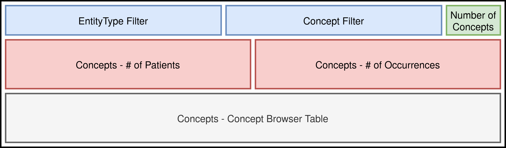
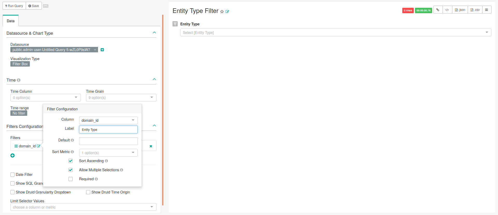
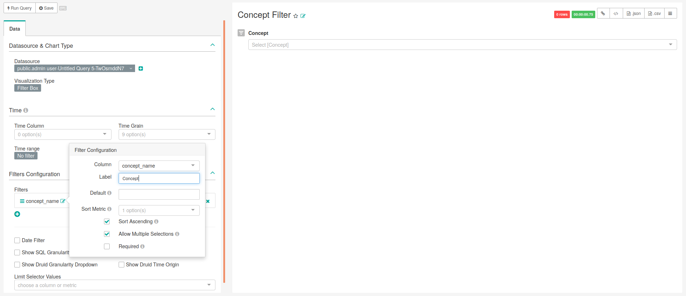
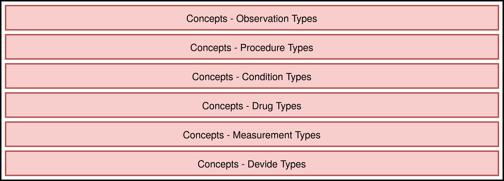
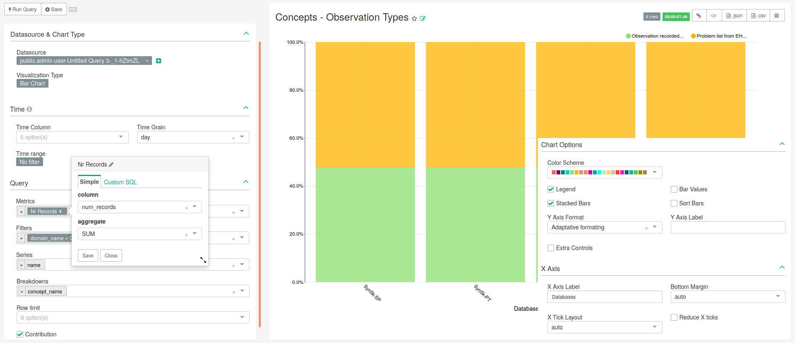

# Concepts Browser

<!-- Discuss the goal of this dashboard... TO DO -->

This chapter follows a different organization due to the reuse of the same query in several charts.

## Concepts General Tab

<!-- Say the goal of this tab TO DO -->

This tab uses an unique query and all the filters and charts were created using the same output. Therefore, this dashboard is composed by two filters, one big number, two bar charts and one table. The filters were splitted in order to apply the filtering of one over the other one. Figure \@ref(fig:conceptsGeneralLayout) shows this dashboard's layout. 


<div class="figure">

<p class="caption">(\#fig:conceptsGeneralLayout)Distribution of charts on the dashboard.</p>
</div>

### SQL query
           
```sql
SELECT
    q1.concept_id AS concept_id,
    q1.concept_name AS concept_name,
    q1.domain_id,
    source.name,
    sum(q1.count_value) AS "Occurrence_count",
    sum(q1.count_person) AS "Person_count",
    CASE 
        WHEN sum(q1.count_value)<=10 THEN '<=10'
        WHEN sum(q1.count_value)<=100 THEN '11-10ˆ2'
        WHEN sum(q1.count_value)<=1000 THEN '10ˆ2-10ˆ3'
        WHEN sum(q1.count_value)<=10000 THEN '10ˆ3-10ˆ4'
        WHEN sum(q1.count_value)<=100000 THEN '10ˆ4-10ˆ5'
        WHEN sum(q1.count_value)<=1000000 THEN '10ˆ5-10ˆ6'
        ELSE '>10ˆ6'
    END AS "magnitude_occurrences",
    CASE 
        WHEN sum(q1.count_person)<=10 THEN '<=10'
        WHEN sum(q1.count_person)<=100 THEN '11-10ˆ2'
        WHEN sum(q1.count_person)<=1000 THEN '10ˆ2-10ˆ3'
        WHEN sum(q1.count_person)<=10000 THEN '10ˆ3-10ˆ4'
        WHEN sum(q1.count_person)<=100000 THEN '10ˆ4-10ˆ5'
        WHEN sum(q1.count_person)<=1000000 THEN '10ˆ5-10ˆ6'
        ELSE '>10ˆ6'
    END AS "magnitude_persons"
FROM (SELECT analysis_id,
             stratum_1 concept_id,
             data_source_id,
             concept_name,
             domain_id,
             count_value, 0 AS count_person
    FROM achilles_results
    JOIN concept ON cast(stratum_1 AS BIGINT)=concept_id
    WHERE analysis_id in (201, 301, 401, 601, 701, 801, 901, 1001, 
        1801)
    UNION (SELECT  analysis_id,
                   stratum_1 concept_id,
                   data_source_id,
                   concept_name,
                   domain_id,
                   0 AS count_value,
                   sum(count_value) AS count_person
            FROM  achilles_results
            JOIN concept on cast(stratum_1 AS BIGINT)=concept_id
            WHERE analysis_id in (202, 401, 601, 701, 801, 901, 
                1001, 1801)
            GROUP BY analysis_id, stratum_1, data_source_id, 
                concept_name, domain_id) ) AS q1
    INNER JOIN public.data_source AS source ON 
        q1.data_source_id=source.id
GROUP BY q1.concept_id, q1.concept_name, q1.domain_id,source.name;
```


### Charts

<!-- Here are all the charts presented in this dashboard using the previous query TO DO -->

#### Entity Type Filter

This filter, which is a type of chart in Superset, was designed to be used in the dashboard aiming the filtering of the data based on the field ''domain_id'' from the table ''concept''. The main characteristics of this filter are presented in Figure \@ref(fig:entityTypeFilter), being the following:

- **Data Tab**:
    - **Visualization Type**: Filter Box
    - **Time range**: No filter
    - **Metrics**:
    - **Filters - Column**: domain_id
    - **Filters - Label**: Entity Type
    - **Data Filter**: Not checked
    - **Row limit**: Empty
    - **Contribution**: Not checked
    - **Instant Filtering**: Checked
    - **Show SQL Granularity Dropdown**: Not checked
    - **Show Druid Granularity Dropdown**: Not checked
    - **Show SQL Time Column**: Not checked
    - **Show Druid Time Origin**: Not checked
    - **Limit Selector Values**: Empty

<div class="figure">

<p class="caption">(\#fig:entityTypeFilter)Settings for creating the database entity type filter.</p>
</div>

#### Concept Filter

Similar to the previous filter, this was designed to be used in the dashboard aiming the filtering of the data based on the field ''concept_name'' from the table ''concept''. The main characteristics of this filter are presented in Figure \@ref(fig:conceptFilter), being the following:

- **Data Tab**:
    - **Visualization Type**: Filter Box
    - **Time range**: No filter
    - **Metrics**:
    - **Filters - Column**: concept_name
    - **Filters - Label**: Concept
    - **Data Filter**: Not checked
    - **Row limit**: Empty
    - **Contribution**: Not checked
    - **Instant Filtering**: Checked
    - **Show SQL Granularity Dropdown**: Not checked
    - **Show Druid Granularity Dropdown**: Not checked
    - **Show SQL Time Column**: Not checked
    - **Show Druid Time Origin**: Not checked
    - **Limit Selector Values**: Empty

<div class="figure">

<p class="caption">(\#fig:conceptFilter)Settings for creating the concept filter.</p>
</div>

#### Number of Concepts

Discuss what is important to see in this chart... TO DO
The main characteristics of this chart are presented in Figure \@ref(fig:visitTypes), being the following:

- **Data Tab**:
    - **Visualization Type**: Bar Chart
    - **Time range**: No filter
    - **Metrics**:
    - **Filters**: Empty
    - **Series**:
    - **Breakdowns**:
    - **Row limit**: Empty
    - **Contribution**: Not checked
- **Costumize Tab**:
    - **Y Axis Label**: 
    - **X Axis Label**: 
    - **Legend**: Checked
    - **Stacked Bars**:
    - **Bar Values**:
    - **Sort Bars**:
    - **Extra Controls**:
    - **Reduce X ticks**:

<div class="figure">

<p class="caption">(\#fig:visitTypes8)Settings for creating chart representing the number of patients at the start of their observation period (bar chart). Image changed to contain information hidden in the customize menu.</p>
</div>

#### Concept Browser Table

<!-- Discuss what is important to see in this chart... TO DO -->

The main characteristics of this chart are presented in Figure \@ref(fig:visitTypes), being the following:

- **Data Tab**:
    - **Visualization Type**: Bar Chart
    - **Time range**: No filter
    - **Metrics**:
    - **Filters**: Empty
    - **Series**:
    - **Breakdowns**:
    - **Row limit**: Empty
    - **Contribution**: Not checked
- **Costumize Tab**:
    - **Y Axis Label**: 
    - **X Axis Label**: 
    - **Legend**: Checked
    - **Stacked Bars**:
    - **Bar Values**:
    - **Sort Bars**:
    - **Extra Controls**:
    - **Reduce X ticks**:

<div class="figure">

<p class="caption">(\#fig:visitTypes3)Settings for creating chart representing the number of patients at the start of their observation period (bar chart). Image changed to contain information hidden in the customize menu.</p>
</div>

#### \# of Occurrences

<!-- Discuss what is important to see in this chart... TO DO -->

The main characteristics of this chart are presented in Figure \@ref(fig:visitTypes), being the following:

- **Data Tab**:
    - **Visualization Type**: Bar Chart
    - **Time range**: No filter
    - **Metrics**:
    - **Filters**: Empty
    - **Series**:
    - **Breakdowns**:
    - **Row limit**: Empty
    - **Contribution**: Not checked
- **Costumize Tab**:
    - **Y Axis Label**: 
    - **X Axis Label**: 
    - **Legend**: Checked
    - **Stacked Bars**:
    - **Bar Values**:
    - **Sort Bars**:
    - **Extra Controls**:
    - **Reduce X ticks**:

<div class="figure">

<p class="caption">(\#fig:visitTypes4)Settings for creating chart representing the number of patients at the start of their observation period (bar chart). Image changed to contain information hidden in the customize menu.</p>
</div>

#### \# of Patients

<!-- Discuss what is important to see in this chart... TO DO -->

The main characteristics of this chart are presented in Figure \@ref(fig:visitTypes), being the following:

- **Data Tab**:
    - **Visualization Type**: Bar Chart
    - **Time range**: No filter
    - **Metrics**:
    - **Filters**: Empty
    - **Series**:
    - **Breakdowns**:
    - **Row limit**: Empty
    - **Contribution**: Not checked
- **Costumize Tab**:
    - **Y Axis Label**: 
    - **X Axis Label**: 
    - **Legend**: Checked
    - **Stacked Bars**:
    - **Bar Values**:
    - **Sort Bars**:
    - **Extra Controls**:
    - **Reduce X ticks**:

<div class="figure">

<p class="caption">(\#fig:visitTypes5)Settings for creating chart representing the number of patients at the start of their observation period (bar chart). Image changed to contain information hidden in the customize menu.</p>
</div>


## Concepts Domains Tab

<!-- Discuss what is important to see in this chart... TO DO -->

This tab is composed of six bar charts that show the percentage of existent concepts in each database. These charts are similar but divided by the concept domains existent in the standard vocabularies, which are the conditions, procedures, drugs, observations, measurements and devices. Figure \@ref(fig:conceptsDomainsLayout) shows this dashboard's layout. 


<div class="figure">

<p class="caption">(\#fig:conceptsDomainsLayout)Distribution of charts on the dashboard.</p>
</div>

### SQL query

```sql
-- Concepts Domains
SELECT source.name,
    CASE WHEN analysis_id = 405 THEN 'Condition'
    WHEN analysis_id = 605 THEN 'Procedure'
    WHEN analysis_id = 705 THEN 'Drug'
    WHEN analysis_id = 805 THEN 'Observation'
    WHEN analysis_id = 1805 THEN 'Measurement'
    WHEN analysis_id = 2105 THEN 'Device'
    ELSE 'Other' END AS domain_name,
    concept_name, sum(count_value) AS num_records
FROM public.achilles_results AS achilles 
    INNER JOIN public.data_source AS source ON 
      achilles.data_source_id=source.id
    INNER JOIN public.concept AS c1 ON 
      stratum_2 = CAST(concept_id AS text)
WHERE analysis_id IN (405, 605, 705, 805, 1805, 2105)
GROUP BY source.name, concept_name, 
    CASE WHEN analysis_id = 405 THEN 'Condition'
    WHEN analysis_id = 605 THEN 'Procedure'
    WHEN analysis_id = 705 THEN 'Drug'
    WHEN analysis_id = 805 THEN 'Observation'
    WHEN analysis_id = 1805 THEN 'Measurement'
    WHEN analysis_id = 2105 THEN 'Device'
    ELSE 'Other' END
```

### Chart settings

The difference between the six charts related to concept domains is the condition in the filter. Therefore, to create all the charts of this dashboard, it is necessary to follow the main characteristics presented in Figure \@ref(fig:conceptsDomainTypes) and the list of possible values for the filter. Those characteristics are the following:

- **Data Tab**:
    - **Visualization Type**: Bar Chart
    - **Time range**: No filter
    - **Metrics**: SUM(num_records) as "Nr Records"
    - **Filters**: domain = **See filter list**
    - **Series**: name
    - **Breakdowns**: concept_name
    - **Row limit**: Empty
    - **Contribution**: Checked
- **Costumize Tab**:
    - **Y Axis Label**: 
    - **X Axis Label**: 
    - **Legend**: Checked
    - **Stacked Bars**: Checked
    - **Bar Values**: Not checked
    - **Sort Bars**: Not checked
    - **Extra Controls**: Not checked
    - **Reduce X ticks**: Not checked
- **Filter List**:
    - **Concepts - Condition Types**: Condition
    - **Concepts - Procedure Types**: Procedure
    - **Concepts - Drug Types**: Drug
    - **Concepts - Observation Types**: Observation
    - **Concepts - Measurement Types**: Measurement
    - **Concepts - Device Types**: Device

<div class="figure">

<p class="caption">(\#fig:conceptsDomainTypes)Settings for creating all the charts related with the concept domains for each databases (bar chart). Image changed to contain information hidden in the customize menu.</p>
</div>
