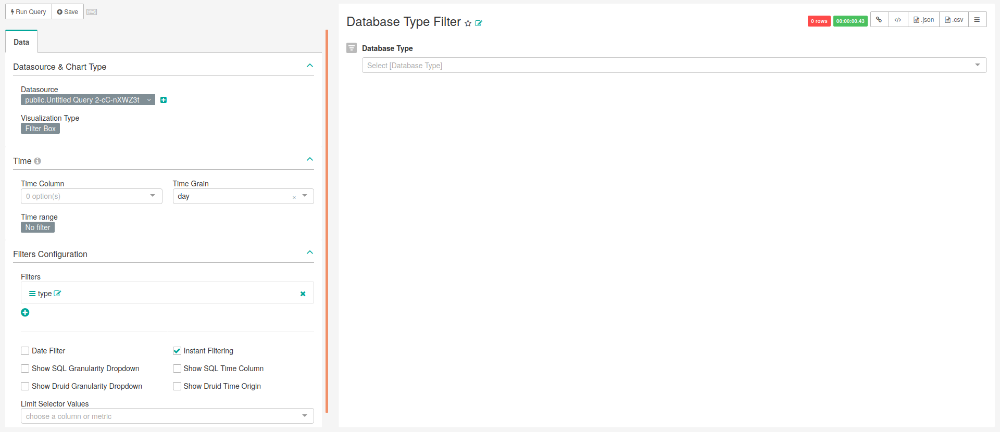

```{r setup, include=FALSE}
knitr::opts_chunk$set(echo = TRUE)
```

# General

NOTE: This chapter is very incomplete and some queries have been changed

<!-- Discuss the goal of this dashboard... TO DO -->

## Database Type Filter

This filter, which is a type of chart in Superset, was designed to be used in the dashboard aiming the filtering of the data based on the field ''database_type'' from the table ''data_source''. It is important to give the alias ''Type'' to this field in the select operations because Superset does not recognize as the same field otherwise.

### SQL query

```sql
--  Country and database type filters
SELECT source.name, 
       country.country AS Country, 
       database_type AS Type,
       source.slug
FROM public.data_source AS source INNER JOIN public.country 
    AS country ON source.country_id=country.id;
```

### Chart settings

The main characteristics of this chart are presented in Figure \@ref(fig:databaseTypeFilter), being the following:

- **Data Tab**:
    - **Visualization Type**: Bar Chart
    - **Time range**: No filter
    - **Metrics**:
    - **Filters**: Empty
    - **Series**:
    - **Breakdowns**:
    - **Row limit**: Empty
    - **Contribution**: Not checked
- **Costumize Tab**:
    - **Y Axis Label**: 
    - **X Axis Label**: 
    - **Legend**: Checked
    - **Stacked Bars**:
    - **Bar Values**:
    - **Sort Bars**:
    - **Extra Controls**:
    - **Reduce X ticks**:

```{r databaseTypeFilter, fig.cap="Settings for creating the database type filter.",echo=FALSE, out.width="100%"}

```

## Country Filter

<!-- Discuss what is important to see in this chart... TO DO -->

### SQL query

```sql
--  Country and database type filters
SELECT source.name, 
       country.country AS Country, 
       database_type AS Type,
       source.slug
FROM public.data_source AS source INNER JOIN public.country 
    AS country ON source.country_id=country.id;
```

### Chart settings

TO DO


## General - World Map

<!-- Discuss what is important to see in this chart... TO DO -->

### SQL query

```sql
--    General - World Map
SELECT  name,
        slug,
        release_date,
        database_type AS Type,
        latitude,
        longitude,
        link,
        country AS Country,
        continent
FROM public.data_source AS source INNER JOIN public.country 
    AS country ON source.country_id=country.id;
```

### Chart settings

TO DO

## General - Network Growth (Summary)

<!-- Discuss what is important to see in this chart... TO DO -->

### SQL query

```sql
-- 108    General - Network Growth (Summary)
SELECT data.source,
       data.country AS Country,
       data.database_type AS Type,
       --cast(stratum_1 as INTEGER )*30 AS Days,
       data.release_date - cast(stratum_1 AS INTEGER) * 
       INTERVAL '1 month' as Time,
       count_value                   AS count
FROM (
     SELECT source.name              AS source,
            achilles.analysis_id     AS analysis_id,
            achilles.stratum_1,
            achilles.stratum_2,
            achilles.stratum_3,
            achilles.stratum_4,
            achilles.stratum_5,
            achilles.count_value,
            country.country,
            source.database_type, 
            source.release_date
     FROM public.achilles_results AS achilles INNER JOIN 
        public.data_source AS source ON
        achilles.data_source_id=source.id
     INNER JOIN public.country AS country ON 
        source.country_id=country.id
     ) data
WHERE analysis_id = 108;
```

### Chart settings

TO DO


## General - Network Growth by Date

<!-- Discuss what is important to see in this chart... TO DO -->

### SQL query

```sql
-- 108    General - Network Growth by Date
SELECT data.source,
       data.country AS Country,
       data.database_type AS Type,
       cast(stratum_1 as Integer)*30 AS DAY,
       count_value                   AS count
FROM (
     SELECT source.name              AS source,
            achilles.analysis_id     AS analysis_id,
            achilles.stratum_1,
            achilles.stratum_2,
            achilles.stratum_3,
            achilles.stratum_4,
            achilles.stratum_5,
            achilles.count_value,
            country.country,
            source.database_type
     FROM public.achilles_results AS achilles INNER JOIN 
        public.data_source AS source ON 
        achilles.data_source_id=source.id
     INNER JOIN public.country AS country ON 
        source.country_id=country.id
     ) data
WHERE analysis_id = 108;
```

### Chart settings

TO DO

## General - Patients per Country

<!-- Discuss what is important to see in this chart... TO DO -->

### SQL query

```sql
-- 1    General - Patients per Country
SELECT source.name,
       country.country AS Country,
       source.database_type AS Type,
       count_value AS patient_count,
       source.slug
FROM public.achilles_results AS achilles 
    INNER JOIN public.data_source AS source ON 
      achilles.data_source_id=source.id
    INNER JOIN public.country AS country ON 
      source.country_id=country.id
WHERE analysis_id = 1;
```

### Chart settings

TO DO

## General - Database Types per Country

<!-- Discuss what is important to see in this chart... TO DO -->

### SQL query

```sql
-- 1    General - Database types per Country
SELECT source.name, 
       country.country AS Country, 
       database_type AS Type,
       count_value AS "Nr_patients",
       source.slug
FROM public.achilles_results AS achilles 
    INNER JOIN public.data_source AS source ON 
      achilles.data_source_id=source.id
    INNER JOIN public.country AS country ON 
      source.country_id=country.id
WHERE analysis_id = 1;
```

### Chart settings

TO DO

