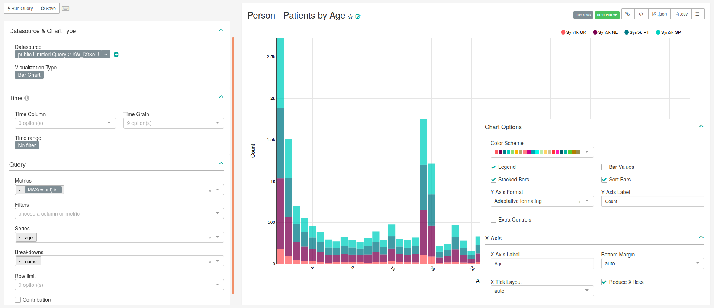
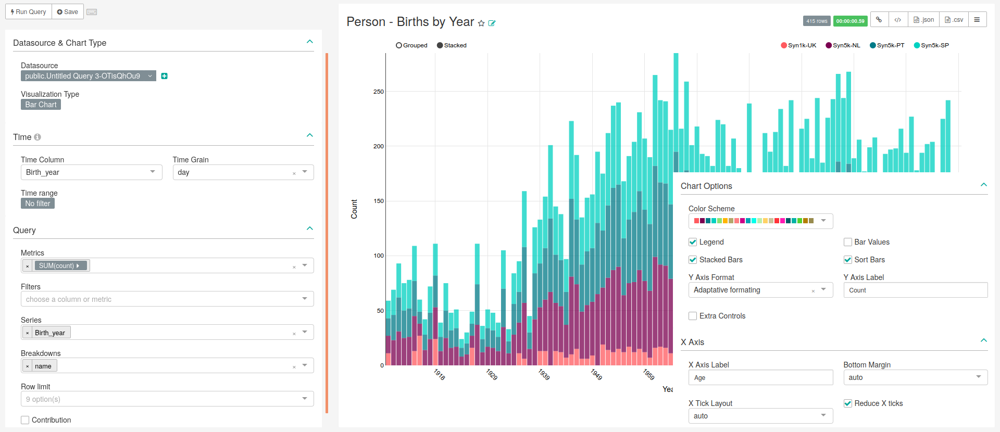
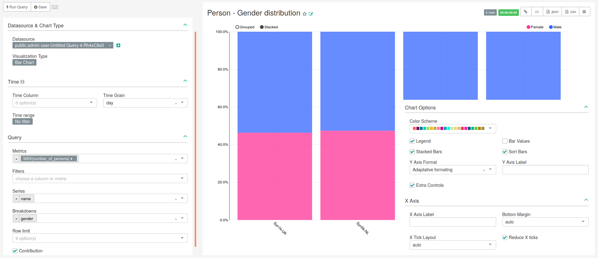

```{r setup, include=FALSE}
knitr::opts_chunk$set(echo = TRUE)
```

# Person


<!-- Discuss the goal of this dashboard... TO DO -->

In this dashboard is present the ''Database Type Filter'', that was detailed in the Chapter General. Besides, it was necessary to customize the dashboard JSON Metadata in order to obtain the colours blue and rose in the chart representing the gender distribution. Therefore, the following entry should be added in the settings of this dashboard:

```json
"label_colors": {
    "Male": "#3366FF", 
    "Female": "#FF3399"
}
```


## Person - Patients by age

<!-- Discuss what is important to see in this chart... TO DO -->

### SQL query

```sql
-- 101  Person - Patients by age
SELECT source.name,
       cast(stratum_1 as int) as Age,
       count_value as count, 
       source.slug
FROM public.achilles_results AS achilles INNER JOIN 
    public.data_source AS source ON 
    achilles.data_source_id=source.id
WHERE analysis_id = 101;
```

### Chart settings
  
The main characteristics of this chart are presented in Figure \@ref(fig:personPatientsByAge), being the following:

- **Data Tab**:
    - **Visualization Type**: Bar Chart
    - **Time range**: No filter
    - **Metrics**: MAX(count)
    - **Filters**: Empty
    - **Series**: age
    - **Breakdowns**: name
    - **Row limit**: Empty
    - **Contribution**: Not checked
- **Costumize Tab**:
    - **Y Axis Label**: Count
    - **X Axis Label**: Age
    - **Legend**: Checked
    - **Stacked Bars**: Checked
    - **Bar Values**: Not checked
    - **Sort Bars**: Checked
    - **Extra Controls**: Not checked
    - **Reduce X ticks**: Checked

```{r personPatientsByAge, fig.cap="Settings for creating chart representing patient by age (bar chart). Image changed to contain information hidden in the customize menu.",echo=FALSE, out.width="100%"}

```

## Person - Births by Year

<!-- Discuss what is important to see in this chart... TO DO -->

### SQL query

```sql
-- 3  Person - Births by year
SELECT source.name,
       stratum_1 AS "Birth_year",
       count_value AS count, 
       source.slug
FROM public.achilles_results AS achilles INNER JOIN 
	  public.data_source AS source ON 
    achilles.data_source_id=source.id
WHERE analysis_id = 3;
```

### Chart settings

The main characteristics of this chart are presented in Figure \@ref(fig:personBirthsByYear), being the following:

- **Data Tab**:
    - **Visualization Type**: Bar Chart
    - **Time range**: No filter
    - **Metrics**: SUM(count)
    - **Filters**: Empty
    - **Series**: Birth_year
    - **Breakdowns**: name
    - **Row limit**: Empty
    - **Contribution**: Not checked
- **Costumize Tab**:
    - **Y Axis Label**: Count
    - **X Axis Label**: Age
    - **Legend**: Checked
    - **Stacked Bars**: Checked
    - **Bar Values**: Not checked
    - **Sort Bars**: Checked
    - **Extra Controls**: Not checked
    - **Reduce X ticks**: Checked

```{r personBirthsByYear, fig.cap="Settings for creating chart representing births by year (bar chart). Image changed to contain information hidden in the customize menu.",echo=FALSE, out.width="100%"}

```


## Person - Gender Distribution

<!-- Discuss what is important to see in this chart... TO DO -->

### SQL query

```sql
-- 2  Person - Gender distribution
SELECT source.name,
       concept_name AS Gender, 
       count_value AS Number_of_persons,
       source.slug
FROM public.achilles_results AS achilles INNER JOIN 
	  public.data_source AS source ON 
    achilles.data_source_id = source.id
	JOIN (
		SELECT '8507' AS concept_id, 'Male' AS concept_name UNION 
		SELECT '8532' AS concept_id, 'Female' AS concept_name) AS 
		concepts ON achilles.stratum_1=concept_id
WHERE analysis_id = 2;
```

### Chart settings

The main characteristics of this chart are presented in Figure \@ref(fig:personGenderDistribution), being the following:

- **Data Tab**:
    - **Visualization Type**: Bar Chart
    - **Time range**: No filter
    - **Metrics**: Max(number_of_persons)
    - **Filters**: Empty
    - **Series**: name
    - **Breakdowns**: gender
    - **Row limit**: Empty
    - **Contribution**: Checked
- **Costumize Tab**:
    - **Y Axis Label**: Empty
    - **X Axis Label**: Databases
    - **Legend**: Checked
    - **Stacked Bars**: Checked
    - **Bar Values**: Not checked
    - **Sort Bars**: Checked
    - **Extra Controls**: Checked
    - **Reduce X ticks**: Checked

```{r personGenderDistribution, fig.cap="Settings for creating chart representing the gender distribution (bar chart). Image changed to contain information hidden in the customize menu.",echo=FALSE, out.width="100%"}

```
