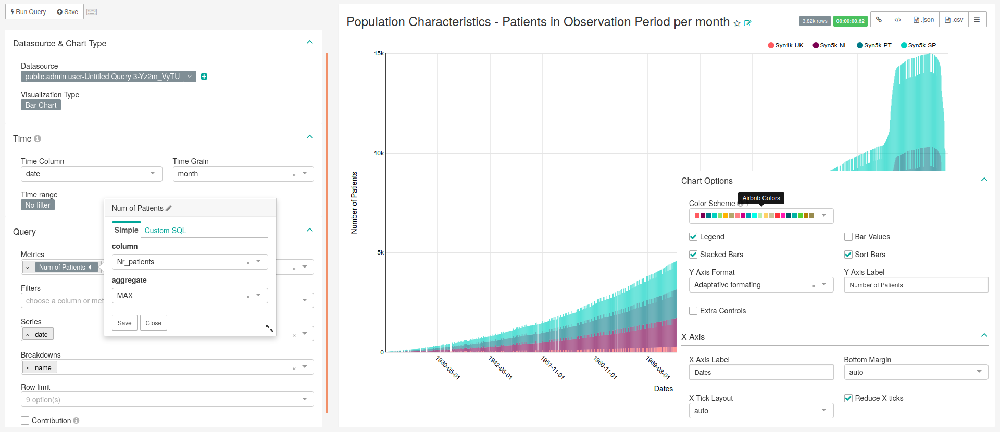
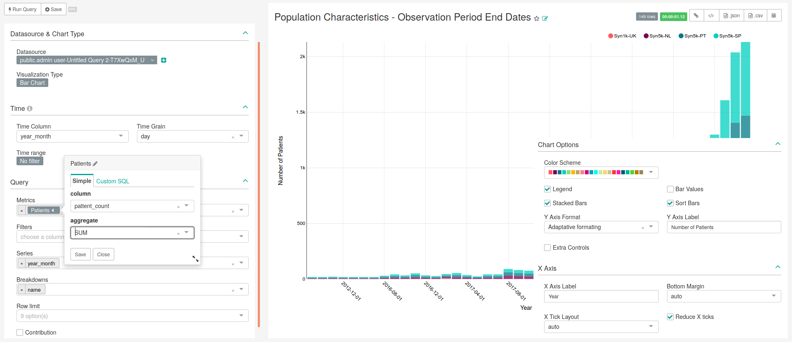
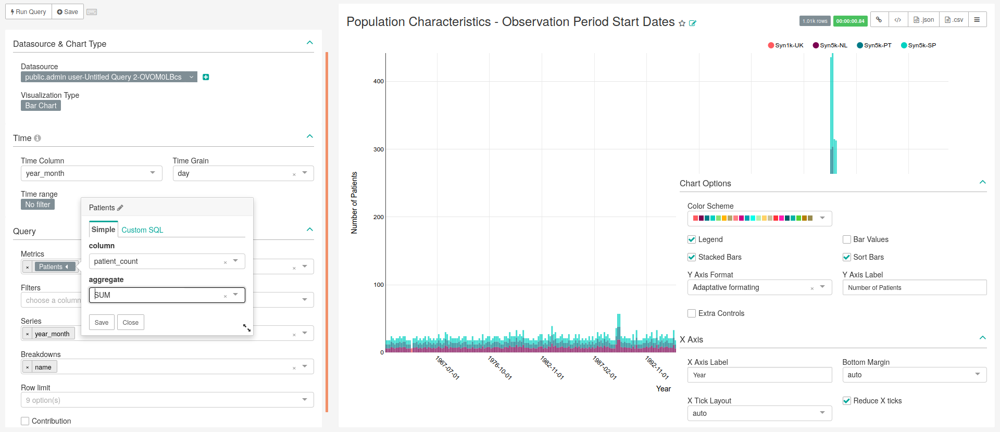

```{r setup, include=FALSE}
knitr::opts_chunk$set(echo = TRUE)
```

# Population Characteristics

<!-- Discuss the goal of this dashboard... TO DO -->

In this dashboard is present the ''Database Type Filter'', that was detailed in the Chapter General.


## Population characteristics - Patients in Observation Period per Month

<!-- Discuss what is important to see in this chart... TO DO -->

Patients in Observation Period per month (whole month)

### SQL query

```sql
-- 110    Population characteristics - 
-- Patients in Observation Period per month (whole month)
SELECT source.name, 
       to_date(stratum_1, 'YYYYMM') as Date,
       count_value as "Nr_patients",
       source.slug
FROM public.achilles_results AS achilles 
	INNER JOIN public.data_source AS source ON 
	  achilles.data_source_id=source.id
WHERE analysis_id = 110;
```

### Chart settings

The main characteristics of this chart are presented in Figure \@ref(fig:populationCharacteristicsPatientsInObservationPeriodPerMonth), being the following:

- **Data Tab**:
    - **Visualization Type**: Bar Chart
    - **Time range**: No filter
    - **Metrics**: MAX(Nr_patients) as "Num of Patients"
    - **Filters**: Empty
    - **Series**: date
    - **Breakdowns**: name
    - **Row limit**: Empty
    - **Contribution**: Not checked
- **Costumize Tab**:
    - **Y Axis Label**: Number of Patients
    - **X Axis Label**: Dates
    - **Legend**: Checked
    - **Stacked Bars**: Checked
    - **Bar Values**: Not checked
    - **Sort Bars**: Checked
    - **Extra Controls**: Not checked
    - **Reduce X ticks**: Checked

```{r populationCharacteristicsPatientsInObservationPeriodPerMonth, fig.cap="Settings for creating chart representing patient in observation per month (bar chart). Image changed to contain information hidden in the customize menu.",echo=FALSE, out.width="100%"}

```

## Population characteristics - Observation Period End Dates

<!-- Discuss what is important to see in this chart... TO DO -->

### SQL query

```sql
-- 112  Population characteristics - 
-- 		Observation Period End Dates
SELECT source.name,
       to_date(stratum_1, 'YYYYMM') as year_month,
       count_value as patient_count
FROM public.achilles_results AS achilles 
	INNER JOIN public.data_source AS source ON 
	  achilles.data_source_id=source.id
WHERE analysis_id = 112;
```

### Chart settings

The main characteristics of this chart are presented in Figure \@ref(fig:populationCharacteristicsObservationPeriodEndDates), being the following:

- **Data Tab**:
    - **Visualization Type**: Bar Chart
    - **Time range**: No filter
    - **Metrics**: SUM(patient_count) as "Patients"
    - **Filters**: Empty
    - **Series**: year_month
    - **Breakdowns**: name
    - **Row limit**: Empty
    - **Contribution**: Not checked
- **Costumize Tab**:
    - **Y Axis Label**: Number of Patients
    - **X Axis Label**: Year
    - **Legend**: Checked
    - **Stacked Bars**: Checked
    - **Bar Values**: Not checked
    - **Sort Bars**: Checked
    - **Extra Controls**: Not checked
    - **Reduce X ticks**: Checked

```{r populationCharacteristicsObservationPeriodEndDates, fig.cap="Settings for creating chart representing the number of patients at the end of their observation period (bar chart). Image changed to contain information hidden in the customize menu.",echo=FALSE, out.width="100%"}

```

## Population characteristics - Observation Period Start Dates

<!-- Discuss what is important to see in this chart... TO DO -->

### SQL query

```sql
-- 111  Population characteristics - 
-- 		Observation Period Start Dates
SELECT source.name,
       to_date(stratum_1, 'YYYYMM') as year_month,
       count_value as patient_count
FROM public.achilles_results AS achilles 
	INNER JOIN public.data_source AS source ON 
	  achilles.data_source_id=source.id
WHERE analysis_id = 111;
```

### Chart settings

The main characteristics of this chart are presented in Figure \@ref(fig:populationCharacteristicsObservationPeriodStartDates), being the following:

- **Data Tab**:
    - **Visualization Type**: Bar Chart
    - **Time range**: No filter
    - **Metrics**: SUM(patient_count) as "Patients"
    - **Filters**: Empty
    - **Series**: year_month
    - **Breakdowns**: name
    - **Row limit**: Empty
    - **Contribution**: Not checked
- **Costumize Tab**:
    - **Y Axis Label**: Number of Patients
    - **X Axis Label**: Year
    - **Legend**: Checked
    - **Stacked Bars**: Checked
    - **Bar Values**: Not checked
    - **Sort Bars**: Checked
    - **Extra Controls**: Not checked
    - **Reduce X ticks**: Checked

```{r populationCharacteristicsObservationPeriodStartDates, fig.cap="Settings for creating chart representing the number of patients at the start of their observation period (bar chart). Image changed to contain information hidden in the customize menu.",echo=FALSE, out.width="100%"}

```

