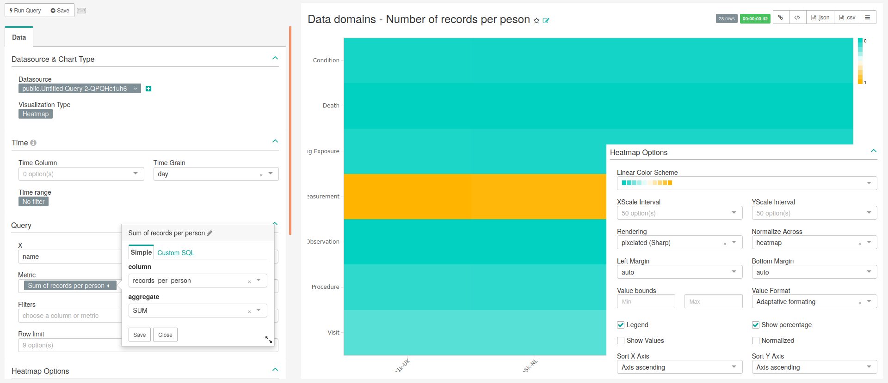

```{r setup, include=FALSE}
knitr::opts_chunk$set(echo = TRUE)
```

# Data Domains

<!-- Discuss the goal of this dashboard... TO DO -->

In this dashboard is present the ''Database Type Filter'', that was detailed in the Chapter General.

## Data Domains - Number of Records per Peson

<!-- Discuss what is important to see in this chart... TO DO -->

### SQL query

```sql
-- 201, 401, 501, 601, 701, 801, 1801, 2101, 2201   
-- Data domains - Number of records per peson
SELECT 
    source.name,
    CASE 
      WHEN analysis_id = 201 THEN 'Visit'
      WHEN analysis_id = 401 THEN 'Condition'
      WHEN analysis_id = 501 THEN 'Death'
      WHEN analysis_id = 601 THEN 'Procedure'
      WHEN analysis_id = 701 THEN 'Drug Exposure'
      WHEN analysis_id = 801 THEN 'Observation'
      WHEN analysis_id = 1801 THEN 'Measurement'
      WHEN analysis_id = 2101 THEN 'Device'
      WHEN analysis_id = 2201 THEN 'Note'
    END AS Data_Domain,
    SUM(count_value) /AVG(num_persons) AS "Records per person",
    source.slug
FROM public.achilles_results AS achilles 
    INNER JOIN public.data_source AS source ON 
      achilles.data_source_id=source.id
    INNER JOIN (
        SELECT data_source_id , count_value AS num_persons 
        FROM achilles_results 
        WHERE analysis_id = 1
        ) counts ON 
      achilles.data_source_id = counts.data_source_id 
GROUP BY analysis_id, source.name, source.slug
HAVING analysis_id IN (201, 401, 501, 601, 701, 801, 1801, 2101, 
    2201)
```

### Chart settings

The main characteristics of this chart are presented in Figure \@ref(fig:dataDomainsNumberOfRecordsPerPeson), being the following:

- **Data Tab**:
    - **Visualization Type**: Heatmap
    - **Time range**: No filter
    - **X**: name
    - **Y**: data_domain
    - **Metric**: SUM(records_per_person) as "Sum of records per person"
    - **Filters**: Empty
    - **Row limit**: Empty
    - **Legend**: Checked
    - **Show percentage**: Checked
    - **Show Values**: Not checked
    - **Normalized**: Not checked

```{r dataDomainsNumberOfRecordsPerPeson, fig.cap="Settings for creating chart representing the number of records per patient in the different data domains (heatmap). Image changed to contain information hidden in the customize menu.",echo=FALSE, out.width="100%"}

```
